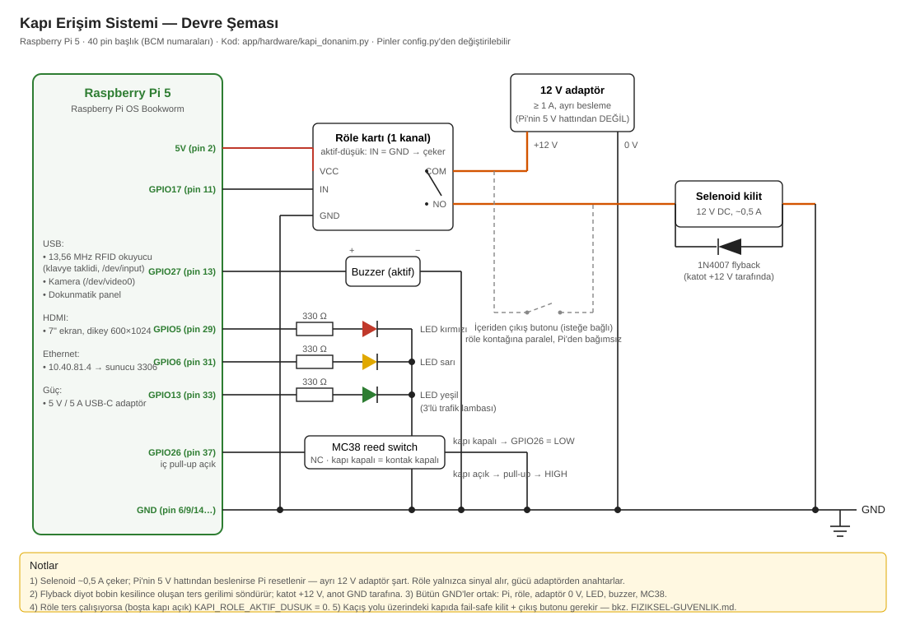

# Kapı Erişim Sistemi

Raspberry Pi + 7" dokunmatik ekran (dikey, 600x1024) için PyQt5 tabanlı
kapı erişim kontrol sistemi. Üç doğrulama yöntemi, yerel SQLite, merkezi
MySQL sunucu senkronizasyonu, Flask web paneli ve fiziksel kapı donanımı.

| Yöntem | Donanım | Not |
|---|---|---|
| RFID kart | 13,56 MHz USB okuyucu | Klavye taklidi, `/dev/input` üzerinden okunur (MFRC522 değil) |
| Yüz tanıma | USB / Pi kamera | OpenCV YuNet + SFace, düz `opencv-python` |
| PIN | Dokunmatik numpad | PBKDF2-SHA256 hash, art arda hatada kilit |

Erişim kararını sunucu verir. Ağ koptuğunda `YEREL_YEDEK=True` ise karar
yerel SQLite'a düşer. Başarılı girişte selenoid kilit `KAPI_ACIK_SANIYE`
kadar açılır, yeşil ışık yanar, kısa bip çalar.

## Mimari

```
Pi (client)  <--- MySQL --->  Sunucu (ana veritabanı)  <--- HTTP --->  Web panel (Flask)
   |
  GPIO: selenoid kilit, buzzer, 3'lü trafik lambası, MC38 kapı sensörü
```

- Pi: giriş arayüzü, yerel kayıt, donanım kontrolü. Ağ koparsa yerelden
  çalışmaya devam eder; kayıtlar kuyruğa alınıp ağ gelince gönderilir.
- Sunucu: yetki listesinin tek doğru kopyası ve tüm geçiş arşivi. Şema:
  `sunucu/*.sql`.
- Web panel (`web/app.py`): personel, kart, rapor, cihaz durumu yönetimi.

## Belgeler

| Belge | İçerik |
|---|---|
| [`ISLETIM-SISTEMI.md`](ISLETIM-SISTEMI.md) | Pi OS (Bookworm/Wayland) ve Windows sunucu kurulumu, açılış sırası, ağ, sorun giderme |
| [`DEVRE-SEMASI.svg`](DEVRE-SEMASI.svg) | Devre şeması: röle, selenoid, flyback diyot, buzzer, LED'ler, MC38 |
| [`DONANIM-SEMASI.md`](DONANIM-SEMASI.md) | Pin haritası, yazılım mimarisi, durum makinesi, ayarlar |
| [`FIZIKSEL-GUVENLIK.md`](FIZIKSEL-GUVENLIK.md) | Kaçış yolu, fail-safe/fail-secure kararı, açık riskler |

## Kapı donanımı

Tam pin haritası, bağlantı şeması ve ayar listesi: `DONANIM-SEMASI.md`.
Çizili devre şeması: `DEVRE-SEMASI.svg`.



| İşlev | BCM | Fiziksel pin |
|---|---|---|
| Selenoid kilit rölesi | GPIO17 | 11 |
| Buzzer (aktif) | GPIO27 | 13 |
| LED kırmızı / sarı / yeşil | GPIO5 / 6 / 13 | 29 / 31 / 33 |
| MC38 manyetik sensör | GPIO26 | 37 |

Trafik lambası durumları:

| Durum | Işık | Kilit | Buzzer |
|---|---|---|---|
| Boşta | kırmızı | kapalı | - |
| Doğrulama sürüyor | sarı | kapalı | - |
| Giriş onaylandı | yeşil | 5 sn açık, sonra oto kilit | kısa bip |
| Giriş reddedildi | kırmızı | kapalı | uzun bip |
| Kapı 20 sn+ açık | sarı, yanıp söner | - | aralıklı bip |
| İzinsiz açılma | kırmızı | - | alarm bip |

Selenoid ~12 V ayrı adaptörden beslenir (Pi'nin 5 V hattından değil).
Röle ile selenoid arasına flyback diyot (1N4007). Kilit tipi (fail-safe /
fail-secure) kararı: `FIZIKSEL-GUVENLIK.md`.

Kod `app/hardware/kapi_donanim.py` içindedir ve `gpiozero` kullanır
(Raspberry Pi OS ile hazır gelir). `gpiozero` yoksa ya da cihaz Pi
değilse mock çalışır: pin sürülmez, eylemler terminale yazılır.

## Kurulum

### Python paketleri

| Paket | Ortam | Amaç |
|---|---|---|
| PyQt5 | hepsi | Arayüz |
| opencv-python >= 4.5.4 | hepsi | Yüz bulma + tanıma (YuNet / SFace) |
| numpy | hepsi | Görüntü dizileri |
| gpiozero | Pi | Röle, buzzer, LED, MC38 (Pi OS'ta hazır) |
| mysql-connector-python | Pi + sunucu | Sunucu senkronizasyonu |
| Flask | sunucu | Web paneli |

```bash
pip install -r requirements.txt
```

### Yüz tanıma modelleri

`data/modeller/` içine iki ONNX dosyası (pip ile gelmez, elle kopyalanır):

- `face_detection_yunet_2023mar.onnx` (~230 KB)
- `face_recognition_sface_2021dec.onnx` (~37 MB)

Kaynak: https://github.com/opencv/opencv_zoo. Pi'de internet yok, dosyalar
`scp` ile taşınır. Yollar: `app/config.py -> YUZ_MODEL_DIR`.

### Raspberry Pi sistem ayarı

İşletim sistemi düzeyindeki tam kurulum (autologin, ekran döndürme,
autostart, NTP, güvenlik duvarı): `ISLETIM-SISTEMI.md`.

- `raspi-config` ile kamerayı etkinleştir (Pi kamera kullanılıyorsa).
- USB RFID okuyucu için ek ayar gerekmez; kullanıcı `input` grubunda
  olmalı: `sudo usermod -aG input $USER`.
- `gpiozero` pin fabrikası: Pi OS Bookworm'da `lgpio` hazır gelir.

### Sunucu

- MySQL / MariaDB.
- Şemayı sırayla kur: `sunucu/000-SIFIRDAN-KURULUM.sql`, sonra numaralı
  `sunucu/0XX-*.sql` dosyaları.
- Web panel: `python web/app.py` veya `sunucu/panel-baslat.bat`.

## Yapılandırma

Değerler şu sırayla okunur: ortam değişkeni, `data/gizli.json`, koddaki
varsayılan.

```bash
cp data/gizli.ornek.json data/gizli.json
# DB şifresi, admin PIN vb. doldurulur
chmod 600 data/gizli.json          # Pi'de
```

`data/gizli.json`, veritabanı ve yüz fotoğrafları `.gitignore` ile sürüm
kontrolü dışındadır.

Sık kullanılan anahtarlar (`app/config.py`):

| Anahtar | Varsayılan | Açıklama |
|---|---|---|
| `KAPI_DB_HOST` / `_USER` / `_PASSWORD` / `_NAME` | LAN | Sunucu MySQL bağlantısı |
| `KAPI_DEVICE_ID` | 1 | Pi'nin sunucudaki cihaz id'si |
| `KAPI_ADMIN_PIN` | 0000 | Admin paneli PIN'i |
| `YEREL_YEDEK` | True | Ağ koptuğunda yerelden karar ver |
| `KAPI_ACIK_SANIYE` | 5 | Onaydan sonra kilidin açık kaldığı süre |
| `KAPI_SENSOR_NC` | 1 | MC38 normalde-kapalı tip mi |

Kapı donanımı anahtarlarının tamamı `DONANIM-SEMASI.md` dosyasındadır.

## Çalıştırma

```bash
python main.py
```

- Windows / masaüstü: mock mod. RFID ve yüz ekranlarında simülasyon
  butonları, kapı donanımı terminale yazılır.
- Raspberry Pi: gerçek donanım, tam ekran.
- Pi'de mock'a zorlamak: `FORCE_MOCK=1 python main.py`
- Kısayollar: `F11` tam ekran, `ESC` normal pencere.

## Proje yapısı

```
main.py                    Uygulama girişi, ekran navigasyonu, donanım sahibi
app/
  config.py                Ayarlar, ortam tespiti, sırların okunması
  dogrula.py               Doğrulama (önce sunucu, sonra yerel yedek)
  store.py                 Yerel SQLite: users, logs, ayar, kapi_olaylari
  sync.py                  Sunucu senkronizasyonu (üç kademeli)
  guvenlik.py              Art arda hatalı denemede kilit
  yuz.py                   YuNet + SFace yüz tanıma
  style.py                 Tema (renk + QSS)
  hardware/
    rfid.py                USB RFID okuyucu (QThread + mock)
    camera.py              OpenCV kamera (QThread)
    kapi_donanim.py        Selenoid, buzzer, trafik lambası, MC38 sensör
  screens/                 main_menu, password, rfid, face, result, admin_*
web/
  app.py                   Flask yönetim paneli
  templates/  static/      Panel arayüzü
sunucu/
  000-SIFIRDAN-KURULUM.sql Ana şema
  0XX-*.sql                Sürüm göçleri (çoklu kapı, roller, yetkiler, ...)
pi/
  kapi-baslat.sh  kapi.desktop   Pi'de otomatik başlatma
data/
  gizli.ornek.json         Yapılandırma şablonu
  modeller/                ONNX model dosyaları (git dışı)
```

## Bilinen kısıtlar

Ayrıntı: `FIZIKSEL-GUVENLIK.md`.

- Canlılık tespiti yok; fotoğraf yüz tanımayı geçebilir. Yüz, kart/PIN
  yerine değil yanında kullanılmalı.
- MySQL bağlantısı ve web panel şifresiz (HTTP). Aynı ağdaki biri
  trafiği okuyabilir.
- Elektrik kesintisinde kapının elle açılması (mekanik anahtar veya
  fail-safe kilit) kurulum öncesi çözülmeli.
- Donanım saati (RTC) yok; sistem saati NTP'den gelir, senkron çakışma
  çözümü saate bağlıdır.
